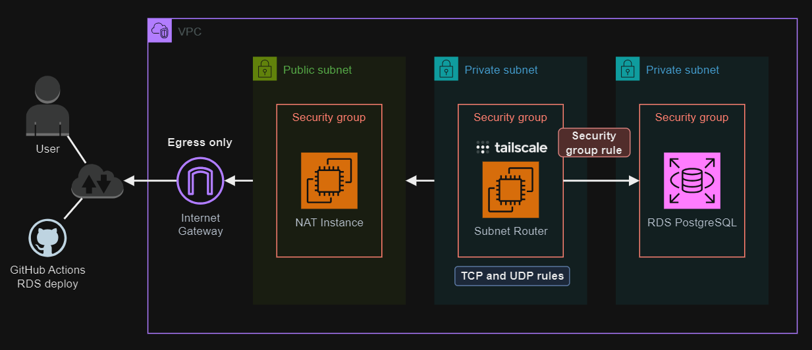

# Tailscale AWS VPC

Using Tailscale in subnet router mode to access RDS in a VPC.

> 💡 This project depends on my repository [epomatti/aws-ec2-imagebuilder][1] to build an optimized image. Or, if you want to configure it manually, use the commands in [ubuntu-tailscale-full.sh](./modules/tailscale/userdata/ubuntu-tailscale-full.sh) to set Tailscale.

Current version of this project uses the subnet router for NAT resolution as well, making it a two-purpose single box. Alternatively, this is an example with separate boxes, which can be adapted with existing code.



## Setup

Create the `.auto.tfvars` from the template and set your variables accordingly.:

```sh
cp config/template.tfvars .auto.tfvars
```

Create the infrastructure:

```sh
terraform init
terraform apply -auto-approve
```

Connect to the Tailscale box using SSM:

```sh
aws ssm start-session --target <instance>
```

You can run some manual checks to verify if everything was installed correctly:

```sh
# Verify the cloud-init start up
cloud-init status
cat /var/log/cloud-init-output.log

# Check the state of the CloudWatch agent
/opt/aws/amazon-cloudwatch-agent/bin/amazon-cloudwatch-agent-ctl -m ec2 -a status

# Look if there are any Tailscale erros in crontab
grep CRON /var/log/syslog
```

Start Tailscale and advertise the subnet routes:

```sh
tailscale up --advertise-routes=10.0.0.0/16 --accept-dns=false
```

Use the link to accept link to register the device to Tailscale. 

Now, add the VPC DNS to the Tailscale namespaces and approve the routes. You can disable key expiry as well.

> ⚠️ Make sure you approve the routes in the Admin panel

| IP       | Namespace                   |
|----------|-----------------------------|
| 10.0.0.2 | us-east-2.rds.amazonaws.com |


Check the results status of Tailscale:

```sh
tailscale ip -4
```

Change the `create_appserver` parameter to `true` and create the private server to test NAT functionality.

You can install and run a speed test tool to also verify performance:

```sh
sudo apt install speedtest-cli
speedtest-cli --secure
```

## GitHub Action

A workflow is available based on the [documentation][3].

To use it, create an OAuth client in Tailscale and set the variables.

## ACLs

Example of a policy to restrict access to personal devices, servers, and environments. More sample [here][2].

```json
{
  "tagOwners": {
    "tag:personal": ["some@user.com"],
    "tag:server":   ["some@user.com"],
    "tag:stage":    ["some@user.com"],
    "tag:prod":     ["some@user.com"],
  },

  "acls": [
    {
      "action": "accept",
      "src":    ["autogroup:member"],
      "dst":    ["autogroup:self:*"],
    },
    {"action": "accept", "src": ["autogroup:member"], "dst": ["tag:server:*"]},
    {"action": "accept", "src": ["tag:personal"], "dst": ["tag:server:*"]},
    {"action": "accept", "src": ["tag:stage"], "dst": ["tag:stage:*"]},
    {"action": "accept", "src": ["tag:prod"], "dst": ["tag:prod:*"]},
    {"action": "accept", "src": ["tag:prod"], "dst": ["tag:prod:*"]},
    {"action": "accept", "src": ["autogroup:owner"], "dst": ["*:*"]},
    {
      "action": "accept",
      "src":    ["some@user.com"],
      "dst":    ["tag:server:*"],
    },
  ],
}
```

## Sources

```
https://tailscale.com/kb/1141/aws-rds
https://tailscale.com/kb/1174/install-debian-bookworm
https://tailscale.com/kb/1019/subnets?tab=linux
https://tailscale.com/kb/1021/install-aws#step-8-close-off-your-firewall
https://tailscale.com/kb/1235/resolv-conf?q=dns
https://repost.aws/questions/QUlEvYKkbUSNmZCiNJFcMpCA/aws-ec2-ubuntu-22-04-dns-issues-with-tailscale
https://tailscale.com/blog/how-tailscale-works
https://www.devzero.io/docs/how-can-i-connect-to-an-aws-rds-database
```

[1]: https://github.com/epomatti/aws-ec2-imagebuilder
[2]: https://tailscale.com/kb/1192/acl-samples
[3]: https://tailscale.com/kb/1276/tailscale-github-action
